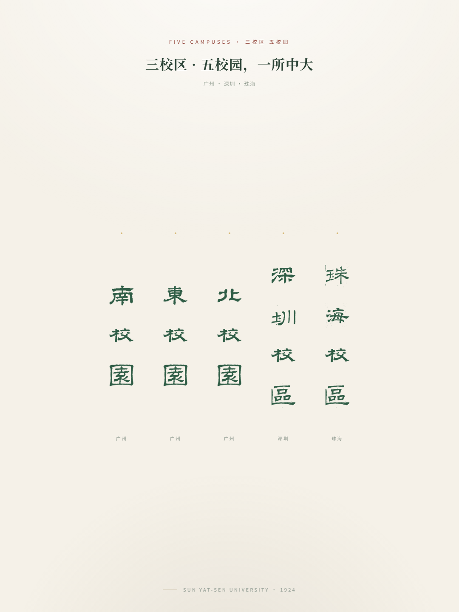

# 中大招宣概念站 · 设计稿

中山大学「三校区 · 五校园」招宣概念站的设计与原型仓库。当前方案为**单文件离线页面**：
五校园校名以竖排仿篆/隶书字形呈现，叠加 SVG 噪声位移滤镜模拟印章落墨的质感。



## 当前方案

`campus-ink-ligen-demo.html`（纯静置展示态）：

- 五个校名词竖排（南校园 / 东校园 / 北校园 / 深圳校区 / 珠海校区），悬停有变色反馈；
- 字形来自 `_src/ligen/processed/*.png`（10 个字的透明底 PNG，base64 内嵌，无需任何外部请求）；
- `#sealInk` 滤镜（`feTurbulence` + `feDisplacementMap`）给字形边缘加手写墨痕；
- 米色宣纸底 + 顶部光晕 / 底部暗角渐变。

直接双击打开即可预览，或本地起个服务：

```bash
python -m http.server 8000
# 浏览器访问 http://localhost:8000/campus-ink-ligen-demo.html
```

## 目录结构

```
├── campus-ink-ligen-demo.html   当前方案（生成物，勿直接编辑）
├── build_lite.py                构建脚本：模板 + 字形注入 → 生成物
├── campus-ink-demo.html         旧方案：篆书字形 + 信纸动画（已被取代）
├── campus-click-demo.html       原型：点击交互（已归档）
├── campus-3d-demo.html / -v2    原型：3D 卡片（已归档）
├── seal-glyphs-generator.py     篆书字形生成器（旧方案）
├── seal-glyphs.json / -ligen.json  字形笔画数据
├── seal-glyphs-preview.png      篆书字形表
├── seal-glyphs-symmetry.png     字形对称性对照图
├── sysu-admission-site-v1.0/    主站 v1.0（待移植当前方案）
└── _src/                        全部源模板与脚本
    ├── ligen-lite.src.html      当前方案的源模板（占位行 __GLYPH_IMAGES_LINE__）
    ├── campus-ink-ligen-demo.v3-anim.bak.html   字形数据来源（GLYPH_IMAGES base64 行）
    ├── ligen/                   隶书字形素材与处理脚本
    │   ├── *.jpg                原始字图（用户提供）
    │   ├── processed/*.png      去背、二值化、裁剪后的字形 PNG
    │   └── process_ligen.py     图片处理脚本（需 Pillow）
    └── *.py                     历史迭代脚本
```

## 修改与重建

`campus-ink-ligen-demo.html` 中的 `GLYPH_IMAGES` 是一行约 98,000 字符的 base64 数据，
**不要直接编辑生成物**。改法：

1. 改版式/文案/样式 → 编辑 `_src/ligen-lite.src.html`；
2. 改字形 → 把新字图放进 `_src/ligen/`，跑 `_src/ligen/process_ligen.py` 重新出 PNG；
3. 重建生成物 → 仓库根目录执行：

```bash
python build_lite.py
```

## 说明

- 页面字体经 CDN 加载（Noto Serif SC / Noto Sans SC），离线时回退到系统字体；
- 校名 Contact/二维码等主站信息见 `sysu-admission-site-v1.0/index.html`；
- 交互动画方案仍在设计中，定稿后移植进主站。
